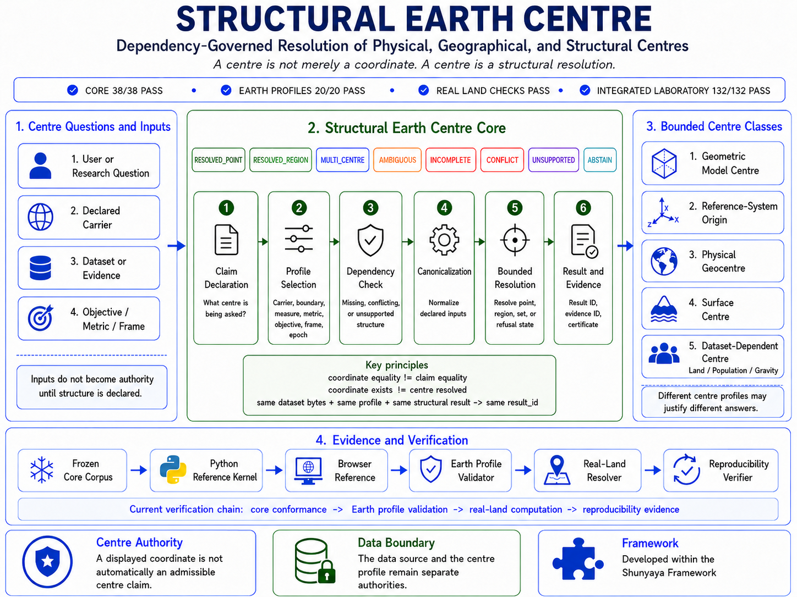

# 🌍 **Structural Earth Centre**

## **Dependency-Governed Resolution of Physical, Geographical, and Structural Centre Claims**

### **A Centre Is Not Merely a Coordinate. A Centre Is a Structural Resolution.**


[](https://github.com/OMPSHUNYAYA/Structural-Earth-Centre/actions/workflows/sec-verification.yml)

---

### 🌐 Try the Live Interactive Laboratories

🌍 [Explore the Structural Earth Centre Laboratory](https://ompshunyaya.github.io/Structural-Earth-Centre/demo/Structural_Earth_Centre_Laboratory_v0_5_0.html)

🔁 [Explore Structural Portability Beyond Centre Resolution](https://ompshunyaya.github.io/Structural-Earth-Centre/demo/Structural_Earth_Centre_Portability_Laboratory_v0_5_0.html)

---

# **The same coordinate can support different claims. The same dataset can support different centres. The same structural primitives can survive a change of domain.**

Structural Earth Centre (SEC) is an executable reference system for resolving centre claims from declared structure rather than treating a coordinate as self-authorizing.

Its governing centre relation is:

`centre resolution = resolve(carrier, boundary, measure, metric, objective, frame, epoch, rules, evidence)`

SEC does not claim that dependency-sensitive centre definitions are new. Its contribution is a bounded executable architecture that makes dependencies explicit, preserves refusal and non-result states, compares claim structures, represents bounded stability, exposes minimal declared routes toward admissibility, and binds results to reproducible evidence.

v0.5.0 adds a portability proof over a domain-neutral structural kernel. The same generic claim-relation, result-spectrum, resolution-frontier, and certificate functions are exercised through two distinct bounded adapters:

`generic structural kernel + centre adapter`

`generic structural kernel + synthetic admissibility adapter`

The adapters supply domain-specific resolution rules. The generic structural primitives remain shared.

The central separations are:

`coordinate != carrier != centre profile != centre claim != result identity != evidence identity`

`claim relation != result relation`

`generic structural semantics != domain adapter semantics`

`unresolved claim != permission to invent missing structure`

---

# 🏗️ **Foundation Architecture at a Glance**

[](docs/Structural-Earth-Centre-Architecture-Diagram.png)

The diagram depicts the centre-resolution foundation and its `132/132 PASS` integrated browser laboratory.

The v0.5.0 portability proof is a separate bounded layer:

`domain claim -> domain adapter -> generic claim material -> shared structural primitive -> bounded result/evidence`

The shared generic primitive set is:

`CLAIM_RELATION`

`RESULT_SPECTRUM`

`RESOLUTION_FRONTIER`

`RESOLUTION_CERTIFICATE`

---

# 🚀 **What v0.5.0 Adds**

## **1. A Domain-Neutral Structural Kernel**

The portability kernel does not contain centre mathematics or admissibility rules.

It operates on generic structures:

`domain_id`

`scope_id`

`profile_id`

`dependencies`

`result`

Its shared operations are applied without changing their semantics between the two demonstration domains.

The generic kernel profile is:

`SEC-GENERIC-STRUCTURAL-KERNEL-1-D01`

---

## **2. Two Bounded Domain Adapters**

### Centre adapter

The centre adapter resolves an exact one-dimensional mean under declared frame and measure dependencies.

It uses exact rational arithmetic.

### Synthetic admissibility adapter

The admissibility adapter resolves a bounded synthetic decision from declared eligibility and evidence dependencies.

Its output carries:

`execution_authority = NONE`

The portability proof therefore demonstrates structural transfer without claiming production authority in either demonstration domain.

---

## **3. Cross-Domain Structural Invariance**

The frozen portability vectors pair structurally equivalent cases across the two domains.

The audit verifies that the same generic machinery preserves:

- claim-relation semantics;
- result-spectrum semantics;
- resolution-frontier semantics;
- certificate binding.

Examples include:

`CLAIM_EQUIVALENT <-> CLAIM_EQUIVALENT`

`LEFT_REFINES_RIGHT <-> LEFT_REFINES_RIGHT`

`COMPATIBLE_OVERLAP <-> COMPATIBLE_OVERLAP`

`DECLARATION_CONFLICT <-> DECLARATION_CONFLICT`

and:

`UNIQUE_MINIMAL_FRONTIER <-> UNIQUE_MINIMAL_FRONTIER`

`MULTIPLE_MINIMAL_FRONTIERS <-> MULTIPLE_MINIMAL_FRONTIERS`

`NO_ADMISSIBLE_FRONTIER <-> NO_ADMISSIBLE_FRONTIER`

The claim is not that the two domains produce the same subject-matter answers.

The claim is that the declared generic structural laws remain stable when the subject matter changes.

---

## **4. Structural Portability Certificate**

The portability certificate binds:

`portability profile + generic kernel profile + adapter profiles + frozen vector set + frozen corpus`

The certificate identity is reproduced by the portability verification stack and recorded in the corresponding machine-readable artifacts.

This certificate records the bounded proof configuration. It is not a claim of universal portability across all possible domains.

---

# 🧠 **Advanced Structural Capabilities Retained**

## Structural Claim Relation

Current bounded relation states include:

`CLAIM_EQUIVALENT`

`LEFT_REFINES_RIGHT`

`RIGHT_REFINES_LEFT`

`COMPATIBLE_OVERLAP`

`DECLARATION_CONFLICT`

`DISJOINT_DECLARATIONS`

Result relation remains separately classified.

## Centre Spectrum

A family of structurally distinct centre claims is preserved rather than silently averaged.

Policy:

`NO_BLIND_AVERAGING_OF_STRUCTURALLY_DISTINCT_RESULTS`

## Resolution Frontier

The system can ask:

`What is the smallest declared repair set that reaches bounded admissibility?`

The system does not invent evidence or undeclared repairs.

## Exact graph-centre portability demonstration

A finite exact graph carrier continues to demonstrate that the advanced centre architecture is not intrinsically tied to geographic coordinates.

---

# 🧬 **Structural Innovation Foundation**

SEC retains:

- Structural Centre Differential;
- Centre Stability Envelope with genuine `RESOLVED_REGION`;
- Symmetry Certificate;
- Centre Resolution Certificate;
- same-dataset controlled profile divergence.

The central symmetry rule remains:

`equivalent candidates + no admitted symmetry breaker -> no forced unique centre`

---

# 🌐 **The Same Dataset Supports Different Legitimate Centre Claims**

The same frozen land dataset bytes are resolved under two declared measures.

| Declared measure | Latitude | Longitude | Result |
|---|---:|---:|---|
| Spherical surface area | `44.847286603` | `28.41498761` | `RESOLVED_POINT` |
| Spherical boundary arc length | `71.590921549` | `66.736078802` | `RESOLVED_POINT` |

Angular separation:

`32.350594616 degrees`

Changed dependency:

`measure`

Differential state:

`SINGLE_DEPENDENCY_DIVERGENCE`

This demonstrates:

`same exact dataset bytes != one intrinsic centre independent of profile`

---

# 🛡️ **Input Admission and Numerical Identity**

The exact core uses rational arithmetic.

The real-land computation uses floating-point spherical operations and quantizes identity-bearing structural fields to 9 decimal places before `result_id` hashing.

Malformed or geographically inadmissible real-land input is rejected before centre computation with:

`INPUT_REJECTED`

---

# 🗺️ **Evidence-Bound Real-Land Result**

Frozen dataset:

[data/ne_110m_land.geojson](data/ne_110m_land.geojson)

Dataset source:

`Natural Earth 1:110m Land data`

Area-vector result:

`LATITUDE_DEG 44.847286603`

`LONGITUDE_DEG 28.41498761`

`SURFACE_FRACTION 0.288698432`

The dataset, result, and evidence identities are recorded in the machine-readable verification artifacts.

This is one declared answer to one declared structural question. It is not presented as a universal geographic centre of Earth.

---

# 🧪 **Verification Headline**

| Verification boundary | Result |
|---|---:|
| Python exact core | `38/38 PASS` |
| Python/browser core parity | `38/38 PASS` |
| Bounded Earth profile validation | `20/20 PASS` |
| Real-land resolver self-test | `26/26 PASS` |
| Reproducibility verifier self-test | `9/9 PASS` |
| Stored real-data reproducibility | `9/9 PASS` |
| Structural innovation audit | `24/24 PASS` |
| Innovation Python/JavaScript parity | `18/18 PASS` |
| Same-dataset profile differential | `13/13 PASS` |
| Advanced structural audit | `30/30 PASS` |
| Advanced Python/JavaScript parity | `22/22 PASS` |
| Browser real-land evidence audit | `7/7 PASS` |
| Integrated centre laboratory | `132/132 PASS` |
| Structural portability audit | `40/40 PASS` |
| Portability Python/JavaScript parity | `27/27 PASS` |

Third-party verification is not claimed.

---

# ⚡ **Try It**

Open the [Live Structural Earth Centre Laboratory](https://ompshunyaya.github.io/Structural-Earth-Centre/demo/Structural_Earth_Centre_Laboratory_v0_5_0.html) and run:

```javascript
await SEC_LAB_AUDIT.runAll({verbose:true})
```

Expected:

`132/132 PASS`

Open the [Live Structural Portability Laboratory](https://ompshunyaya.github.io/Structural-Earth-Centre/demo/Structural_Earth_Centre_Portability_Laboratory_v0_5_0.html) and run:

```javascript
await SEC_PORTABILITY_AUDIT.runAll({verbose:true})
```

Expected:

`40/40 PASS`

---

# 💻 **Command-Line Verification**

The primary command-line verification entry point is:

```text
python -B verify/SEC_Verification_Runner_v0_5_0.py
```

The runner checks freeze hygiene, verifies `SHA256SUMS.txt` completeness and file digests across the declared frozen technical surface, and executes all 13 command-line verification stages.

Runner configuration can be checked without executing the complete stack:

```text
python -B verify/SEC_Verification_Runner_v0_5_0.py --self-test
```

Individual verification boundaries can also be run directly:

```text
python -B demo/Structural_Earth_Centre_Reference_Kernel_v0_5_0.py --corpus corpus --audit
python -B verify/SEC_Cross_Implementation_Parity_Auditor_v0_5_0.py --root . --verbose
python -B verify/SEC_Earth_Profile_Validator_v0_5_0.py --profiles profiles --verbose
python -B verify/SEC_Real_Land_Centre_Resolver_v0_5_0.py --self-test
python -B verify/SEC_Real_Land_Reproducibility_Verifier_v0_5_0.py --self-test
python -B verify/SEC_Real_Land_Reproducibility_Verifier_v0_5_0.py --fetch-evidence evidence/SEC_Real_Land_Centre_Natural_Earth_110m_Fetch_v0_5_0.json --offline-evidence evidence/SEC_Real_Land_Centre_Natural_Earth_110m_Offline_v0_5_0.json
python -B verify/SEC_Structural_Centre_Resolver_v0_5_0.py --audit --verbose
python -B verify/SEC_Structural_Centre_Innovation_Parity_Auditor_v0_5_0.py --root . --verbose
python -B verify/SEC_Real_Land_Profile_Differential_v0_5_0.py --root . --verbose
python -B verify/SEC_Structural_Centre_Advanced_Resolver_v0_5_0.py --audit --verbose
python -B verify/SEC_Structural_Centre_Advanced_Parity_Auditor_v0_5_0.py --root . --verbose
python -B verify/SEC_Structural_Portability_Kernel_v0_5_0.py --profiles profiles --audit --verbose
python -B verify/SEC_Structural_Portability_Parity_Auditor_v0_5_0.py --root . --verbose
```

The standalone real-land resolver accepts the declared area-vector profile. Supplying the boundary-vector profile is rejected with `PROFILE_ID_MISMATCH` and points to:

`verify/SEC_Real_Land_Profile_Differential_v0_5_0.py`

On systems where Python 3 is exposed as `python3`, substitute `python3`.

---

# 🔒 **Integrity and Identity Boundaries**

`SHA256SUMS.txt` covers every file under:

`corpus/`

`data/`

`demo/`

`evidence/`

`profiles/`

`verify/`

Documentation and root-level repository files are outside this technical byte-freeze boundary.

SEC structural identities are canonical identities computed over declared normalized content. `SHA256SUMS.txt` records SHA-256 digests of raw file bytes. These identity forms serve different purposes and are not expected to be equal.

Detailed structural, result, certificate, evidence, and file identities remain available in the corresponding machine-readable artifacts and verification outputs rather than being duplicated here.

---

# 📚 **Documentation and Key Files**

Key repository files:

- [Verification Runner](verify/SEC_Verification_Runner_v0_5_0.py)
- [Python Reference Kernel](demo/Structural_Earth_Centre_Reference_Kernel_v0_5_0.py)
- [SHA-256 Manifest](SHA256SUMS.txt)

Documentation:

- [Quickstart](docs/Quickstart.md)
- [FAQ](docs/FAQ.md)
- [Verification Guide](docs/VERIFY.md)
- [Architecture Diagram](docs/Structural-Earth-Centre-Architecture-Diagram.png)
- [Concept and Architecture](docs/Structural_Earth_Centre_Concept_and_Architecture_v0_5_0.txt)
- [Core Mathematical and Resolution Specification](docs/Structural_Earth_Centre_Core_Mathematical_and_Resolution_Specification_v0_5_0.txt)
- [Bounded Earth Carrier and Centre Profile Specification](docs/SEC_Bounded_Earth_Carrier_and_Centre_Profile_Specification_v0_5_0.txt)
- [Structural Differential, Stability, and Certification](docs/SEC_Structural_Centre_Differential_Stability_and_Certification_v0_5_0.txt)
- [Claim Relation, Spectrum, Frontier, and Portability](docs/SEC_Claim_Relation_Spectrum_Frontier_and_Portability_v0_5_0.txt)
- [Structural Portability Proof](docs/SEC_Structural_Portability_Proof_v0_5_0.txt)
- [Cross-Implementation Parity Verification](docs/SEC_Cross_Implementation_Parity_Verification_v0_5_0.txt)
- [Real-Land Centre Computation](docs/SEC_Real_Land_Centre_Computation_v0_5_0.txt)

---

# ⚠️ **Claim Boundary**

SEC does not claim:

- that dependency-sensitive centre definitions were first discovered here;
- a universal centre of Earth;
- production geodesy suitability;
- a universal algebra for every possible claim relation;
- a universally portable structural kernel across all domains;
- causal proof from structural relation or differential output;
- that minimal structural repair is automatically the best real-world action;
- authority equivalence among members of a spectrum;
- uncertainty coverage outside declared perturbation families;
- new graph-theoretic centre mathematics;
- scientific certification;
- third-party verification.

Its bounded v0.5.0 portability claim is:

`the same declared generic structural primitives reproduce matched relation, spectrum, frontier, and certificate semantics across two bounded domain adapters under the frozen portability corpus`

---

## 📜 License

See: [LICENSE](LICENSE)

The Structural Earth Centre reference implementation and machine-readable verification artifacts are free to use, copy, modify, test, study, and redistribute without a license fee, subject to the terms of the Structural Earth Centre License v1.0.

Documentation, architecture materials, specifications, diagrams, and explanatory content are subject to the separate terms stated in the LICENSE, including applicable non-commercial use conditions.

This repository does not claim recognition as a formal technical standard, scientific certification, production qualification, or third-party verification.

---

# **Final Summary**

SEC v0.5.0 can ask:

`What declared structure makes this centre claim admissible?`

`How are these two claims structurally related?`

`Why did their results diverge?`

`What family of results exists without blind aggregation?`

`What minimal declared repair set reaches admissibility?`

`Does the same generic structural machinery preserve its semantics when the subject matter changes?`

The v0.5.0 portability proof answers that last question within a deliberately bounded two-domain corpus.

A centre is not merely a coordinate.

**A centre is a structural resolution.**
